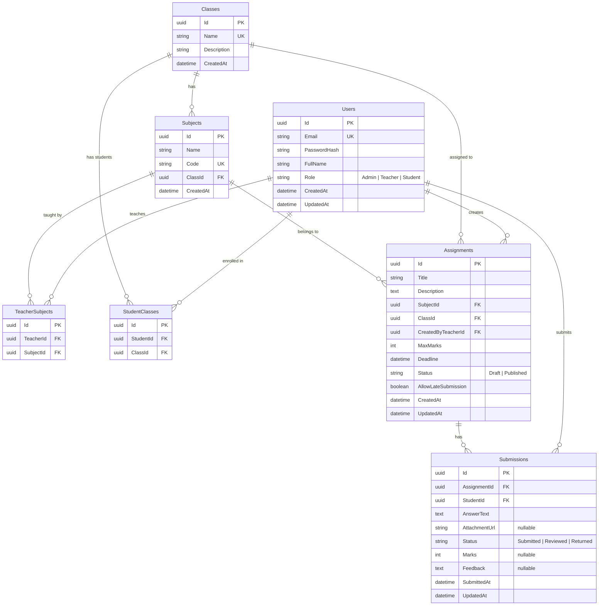

# Assignment & Submission Management System — Implementation Plan

A role-based full-stack web application for a school/college, enabling teachers to create assignments, students to submit work, and admins to manage the system.

> [!IMPORTANT]
> **Deadline:** 14 August, 2026 (5 days remaining)
> **Tech Stack:** Next.js + TypeScript (Frontend) | ASP.NET Core Web API + C# (Backend) | PostgreSQL (Database) | JWT Auth

---

## Project Division — 6 Parts

The project is divided into **6 sequential parts**, each building on the previous. Each part is a self-contained milestone that can be developed and tested independently.

| Part | Name | Estimated Effort | Description |
|------|------|-----------------|-------------|
| **1** | Project Scaffolding & Database Design | ~3 hours | Repo setup, project structure, DB schema, migrations, seed data |
| **2** | Authentication & Authorization | ~4 hours | User management, JWT login, role-based authorization, middleware |
| **3** | Core Backend APIs | ~5 hours | All CRUD APIs for classes, subjects, assignments, submissions |
| **4** | Frontend Foundation & Auth Pages | ~4 hours | Next.js setup, UI design system, login, dashboards per role |
| **5** | Frontend Features & Integration | ~6 hours | All assignment/submission flows, forms, API integration |
| **6** | Testing, Polish & Deployment | ~4 hours | Unit tests, README, Docker, seed data, final QA |

---

## Part 1: Project Scaffolding & Database Design

### Goals
- Initialize the monorepo structure
- Design and implement the PostgreSQL database schema
- Create EF Core migrations and seed data
- Set up the ASP.NET Core Web API project skeleton

### Database Schema Design



### Project Structure

```
Onno Rokom Projukti/
├── backend/
│   ├── AssignmentMS.API/              # ASP.NET Core Web API
│   │   ├── Controllers/
│   │   ├── Program.cs
│   │   └── appsettings.json
│   ├── AssignmentMS.Core/             # Domain models, interfaces, DTOs
│   │   ├── Entities/
│   │   ├── DTOs/
│   │   ├── Interfaces/
│   │   └── Enums/
│   ├── AssignmentMS.Infrastructure/   # EF Core, repositories, services
│   │   ├── Data/
│   │   ├── Repositories/
│   │   ├── Services/
│   │   └── Migrations/
│   └── AssignmentMS.Tests/            # Unit tests (xUnit)
│       ├── Services/
│       └── Controllers/
├── frontend/                          # Next.js + TypeScript
│   ├── src/
│   │   ├── app/                       # App Router pages
│   │   ├── components/
│   │   ├── lib/                       # API client, auth utilities
│   │   ├── types/
│   │   └── hooks/
│   ├── public/
│   └── package.json
├── .env.example
├── docker-compose.yml (optional)
├── README.md
└── .gitignore
```

### Tasks
- [NEW] Initialize Git repository with `.gitignore`
- [NEW] Create ASP.NET Core solution with Clean Architecture (API, Core, Infrastructure, Tests)
- [NEW] Define all Entity models in `AssignmentMS.Core/Entities/`
- [NEW] Configure `ApplicationDbContext` with Fluent API relationships
- [NEW] Create initial EF Core migration
- [NEW] Create seed data (Admin, Teacher, Student accounts + sample classes/subjects)

### Seed / Demo Credentials

| Role | Email | Password |
|------|-------|----------|
| Admin | `admin@school.com` | `Admin@123` |
| Teacher | `teacher@school.com` | `Teacher@123` |
| Student | `student@school.com` | `Student@123` |

---

## Part 2: Authentication & Authorization

### Goals
- Implement JWT-based authentication
- Implement role-based authorization
- Create login/register endpoints
- Set up auth middleware and policies

### API Endpoints

| Method | Endpoint | Auth | Roles | Description |
|--------|----------|------|-------|-------------|
| POST | `/api/auth/login` | No | All | Login with email/password, returns JWT |
| POST | `/api/auth/register` | Yes | Admin | Admin registers new users |
| GET | `/api/auth/me` | Yes | All | Get current user profile |
| PUT | `/api/auth/change-password` | Yes | All | Change own password |

### Implementation Details

#### [NEW] `AssignmentMS.Core/DTOs/Auth/`
- `LoginRequestDto` — Email, Password
- `LoginResponseDto` — Token, User info, Role, ExpiresAt
- `RegisterRequestDto` — Email, Password, FullName, Role

#### [NEW] `AssignmentMS.Infrastructure/Services/AuthService.cs`
- Password hashing with BCrypt
- JWT token generation with role claims
- Token validation configuration

#### [MODIFY] `AssignmentMS.API/Program.cs`
- Configure JWT Bearer Authentication
- Configure Authorization policies (`AdminOnly`, `TeacherOnly`, `StudentOnly`, `TeacherOrAdmin`)
- Add CORS policy for Next.js frontend

#### [NEW] `AssignmentMS.API/Controllers/AuthController.cs`
- Login endpoint with validation
- Register endpoint (Admin-only)
- Profile endpoint

---

## Part 3: Core Backend APIs

### Goals
- Implement all CRUD operations for the business domain
- Add request validation with FluentValidation
- Add proper error handling middleware
- Configure Swagger/OpenAPI documentation
- Add structured logging with Serilog

### API Endpoints

#### Admin — User Management

| Method | Endpoint | Roles | Description |
|--------|----------|-------|-------------|
| GET | `/api/users` | Admin | List all users (with role filter, pagination) |
| GET | `/api/users/{id}` | Admin | Get user details |
| PUT | `/api/users/{id}` | Admin | Update user |
| DELETE | `/api/users/{id}` | Admin | Delete user |

#### Admin — Class & Subject Management

| Method | Endpoint | Roles | Description |
|--------|----------|-------|-------------|
| GET | `/api/classes` | Admin, Teacher | List all classes |
| POST | `/api/classes` | Admin | Create a class |
| PUT | `/api/classes/{id}` | Admin | Update a class |
| DELETE | `/api/classes/{id}` | Admin | Delete a class |
| GET | `/api/subjects` | Admin, Teacher | List all subjects |
| POST | `/api/subjects` | Admin | Create a subject |
| PUT | `/api/subjects/{id}` | Admin | Update a subject |
| DELETE | `/api/subjects/{id}` | Admin | Delete a subject |
| POST | `/api/classes/{id}/students` | Admin | Assign student to class |
| DELETE | `/api/classes/{classId}/students/{studentId}` | Admin | Remove student from class |
| POST | `/api/subjects/{id}/teachers` | Admin | Assign teacher to subject |
| DELETE | `/api/subjects/{subjectId}/teachers/{teacherId}` | Admin | Remove teacher from subject |

#### Teacher — Assignment Management

| Method | Endpoint | Roles | Description |
|--------|----------|-------|-------------|
| GET | `/api/assignments` | Teacher, Admin | List assignments (filter by class, subject, status) |
| GET | `/api/assignments/{id}` | Teacher, Admin, Student | Get assignment details |
| POST | `/api/assignments` | Teacher | Create assignment (Draft or Published) |
| PUT | `/api/assignments/{id}` | Teacher | Update assignment |
| DELETE | `/api/assignments/{id}` | Teacher, Admin | Delete assignment |
| PATCH | `/api/assignments/{id}/publish` | Teacher | Publish a draft assignment |

#### Student — Assignment Viewing & Submission

| Method | Endpoint | Roles | Description |
|--------|----------|-------|-------------|
| GET | `/api/students/assignments` | Student | List published assignments for the student's class |
| GET | `/api/students/assignments/{id}` | Student | View assignment details + own submission |
| POST | `/api/submissions` | Student | Submit an answer |
| PUT | `/api/submissions/{id}` | Student | Update submission (before deadline only) |
| GET | `/api/submissions/my` | Student | List own submissions with status/marks |

#### Teacher — Submission Review

| Method | Endpoint | Roles | Description |
|--------|----------|-------|-------------|
| GET | `/api/assignments/{id}/submissions` | Teacher, Admin | List all submissions for an assignment |
| GET | `/api/submissions/{id}` | Teacher, Admin | View a specific submission |
| PUT | `/api/submissions/{id}/review` | Teacher | Assign marks + feedback, change status |

### Cross-cutting Concerns

#### [NEW] Global Exception Handling Middleware
- Returns structured error responses (`{ error, message, details }`)
- Logs unhandled exceptions

#### [NEW] Request Validation (FluentValidation)
- Validators for all DTOs
- Automatic 400 responses with field-level errors

#### [MODIFY] Swagger Configuration
- JWT Bearer auth in Swagger UI
- Grouped endpoints by controller
- XML doc comments

#### [NEW] Pagination Support
- `PaginatedResponse<T>` wrapper with `Page`, `PageSize`, `TotalCount`, `TotalPages`

---

## Part 4: Frontend Foundation & Auth Pages

### Goals
- Initialize Next.js 14+ project with TypeScript and App Router
- Build a polished, responsive design system
- Implement login page and authentication flow
- Build role-based dashboards (Admin, Teacher, Student)
- Set up API client with interceptors

### Pages & Components

#### [NEW] Design System (`src/components/ui/`)
- Color palette: Deep indigo/violet primary, slate neutrals, amber accents
- Typography: Inter font family
- Components: Button, Input, Card, Modal, Table, Badge, Sidebar, Toast
- Dark mode support
- Glassmorphism cards, smooth transitions, micro-animations

#### [NEW] Auth Pages
- `/login` — Login form with validation, role-based redirect
- Auth context provider with JWT storage and auto-refresh

#### [NEW] Layout & Navigation
- Sidebar navigation (role-specific menu items)
- Top bar with user info, role badge, logout
- Responsive: collapsible sidebar on mobile

#### [NEW] Dashboard Pages
- `/dashboard` — Role-based dashboard redirect
- `/admin/dashboard` — Stats cards (total users, classes, assignments, submissions)
- `/teacher/dashboard` — My assignments, recent submissions, pending reviews
- `/student/dashboard` — My assignments, upcoming deadlines, submission status

#### [NEW] API Client (`src/lib/api.ts`)
- Axios instance with base URL and JWT interceptor
- Auto-redirect to login on 401
- Type-safe API functions

---

## Part 5: Frontend Features & Integration

### Goals
- Implement all CRUD pages for admin, teacher, and student flows
- Build forms with validation (React Hook Form + Zod)
- Full API integration with loading states and error handling
- Responsive tables with pagination

### Admin Pages

| Page | Route | Features |
|------|-------|----------|
| User Management | `/admin/users` | List, create, edit, delete users; role filter |
| Class Management | `/admin/classes` | CRUD classes; assign students to classes |
| Subject Management | `/admin/subjects` | CRUD subjects; assign teachers to subjects |
| All Assignments | `/admin/assignments` | View all assignments across teachers |
| All Submissions | `/admin/submissions` | View all submissions across assignments |

### Teacher Pages

| Page | Route | Features |
|------|-------|----------|
| My Assignments | `/teacher/assignments` | List own assignments; filter by status/class |
| Create Assignment | `/teacher/assignments/new` | Form: title, description, class, subject, deadline, max marks, draft/publish |
| Edit Assignment | `/teacher/assignments/[id]/edit` | Pre-filled edit form |
| Assignment Detail | `/teacher/assignments/[id]` | View details + list of submissions |
| Review Submission | `/teacher/submissions/[id]/review` | View student answer, assign marks, write feedback, change status |

### Student Pages

| Page | Route | Features |
|------|-------|----------|
| My Assignments | `/student/assignments` | List published assignments for my class with deadlines |
| Assignment Detail | `/student/assignments/[id]` | View details, submit answer or view existing submission |
| My Submissions | `/student/submissions` | List all my submissions with status, marks, feedback |

### Key UI Patterns
- **Form Validation**: React Hook Form + Zod schemas, inline error messages
- **Loading States**: Skeleton loaders on data fetch
- **Empty States**: Illustrated empty states with CTAs
- **Confirmation Dialogs**: For delete and status change actions
- **Toast Notifications**: Success/error feedback on all mutations
- **Deadline Indicators**: Color-coded badges (upcoming, due soon, overdue)
- **Rich Text**: Assignment description support with markdown or simple WYSIWYG

---

## Part 6: Testing, Polish & Deployment Readiness

### Goals
- Write unit tests for critical business logic
- Write integration tests for key API endpoints
- Finalize README with complete documentation
- Create Docker setup (optional but recommended)
- Final QA pass on all flows

### Unit Tests (xUnit + Moq)

| Test Category | Tests |
|---------------|-------|
| **AuthService** | Login with valid/invalid credentials, token generation, password hashing |
| **AssignmentService** | Create assignment, publish draft, enforce teacher ownership, validate deadline |
| **SubmissionService** | Submit before deadline, reject after deadline, update before deadline, reject update after deadline |
| **Authorization** | Student cannot create assignment, teacher cannot manage users, admin can do all |
| **SubmissionWorkflow** | Submit → Review → Marks/Feedback flow, status transitions |
| **Validation** | Required fields, max marks > 0, deadline in future, email format |

### Test Structure
```
AssignmentMS.Tests/
├── Services/
│   ├── AuthServiceTests.cs
│   ├── AssignmentServiceTests.cs
│   └── SubmissionServiceTests.cs
├── Controllers/
│   ├── AuthControllerTests.cs
│   ├── AssignmentControllerTests.cs
│   └── SubmissionControllerTests.cs
└── Helpers/
    └── TestFixtures.cs
```

### README.md Contents
- Project overview & features summary
- Technology stack
- Project structure diagram
- Prerequisites (Node.js, .NET SDK, PostgreSQL)
- Step-by-step setup instructions (backend, frontend, database)
- How to run migrations and seed data
- How to run tests (`dotnet test`)
- Demo credentials table
- Design decisions & assumptions
- Known limitations
- API documentation (Swagger URL)

### Docker (Optional)
```yaml
# docker-compose.yml
services:
  db:         # PostgreSQL 16
  api:        # ASP.NET Core API
  frontend:   # Next.js
```

### `.env.example`
```env
# Database
DB_HOST=localhost
DB_PORT=5432
DB_NAME=assignment_ms
DB_USER=postgres
DB_PASSWORD=your_password_here

# JWT
JWT_SECRET=your_jwt_secret_here
JWT_ISSUER=AssignmentMS
JWT_AUDIENCE=AssignmentMS
JWT_EXPIRY_HOURS=24

# Frontend
NEXT_PUBLIC_API_URL=http://localhost:5000/api
```

---

## Design Assumptions (to document in README)

1. **One class per student**: A student is enrolled in exactly one class at a time (simplifies assignment visibility).
2. **Teacher ownership**: A teacher can only manage assignments for subjects they are assigned to.
3. **Submission updates**: Students can update their submission before the deadline unless the teacher has already reviewed it.
4. **No file uploads**: Submissions are text-based (answer text field). File attachment URL is optional and stores a link.
5. **Draft assignments**: Only published assignments are visible to students. Teachers can toggle between Draft and Published.
6. **Marks validation**: Marks assigned cannot exceed the assignment's `MaxMarks`.
7. **Single submission**: Each student can submit only once per assignment (update allowed before deadline).
8. **Admin is a superuser**: Admin can view everything but doesn't create assignments or submit answers.

---

## Verification Plan

### Automated Tests
```bash
# Run all backend unit tests
cd backend
dotnet test --verbosity normal

# Run frontend (if time permits)
cd frontend
npm test
```

### Manual Verification
1. Login as each role and verify dashboard content
2. Admin: Create class → Create subject → Assign teacher → Assign student
3. Teacher: Create draft assignment → Publish → View submissions
4. Student: View published assignment → Submit answer → View marks/feedback
5. Teacher: Review submission → Assign marks/feedback → Verify student sees it
6. Test role-based access: Student tries `/admin/users` → redirected
7. Test deadline enforcement: Submit after deadline → rejected
8. Swagger UI: All endpoints documented and testable
